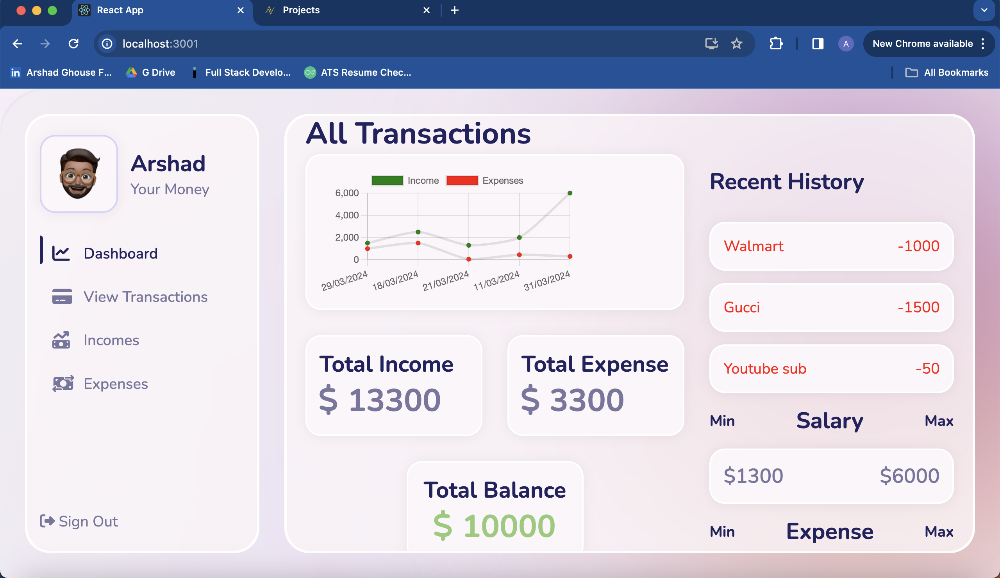
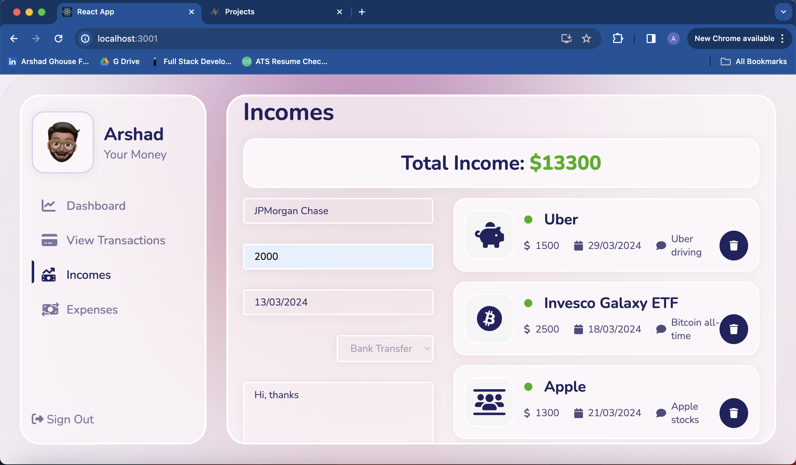
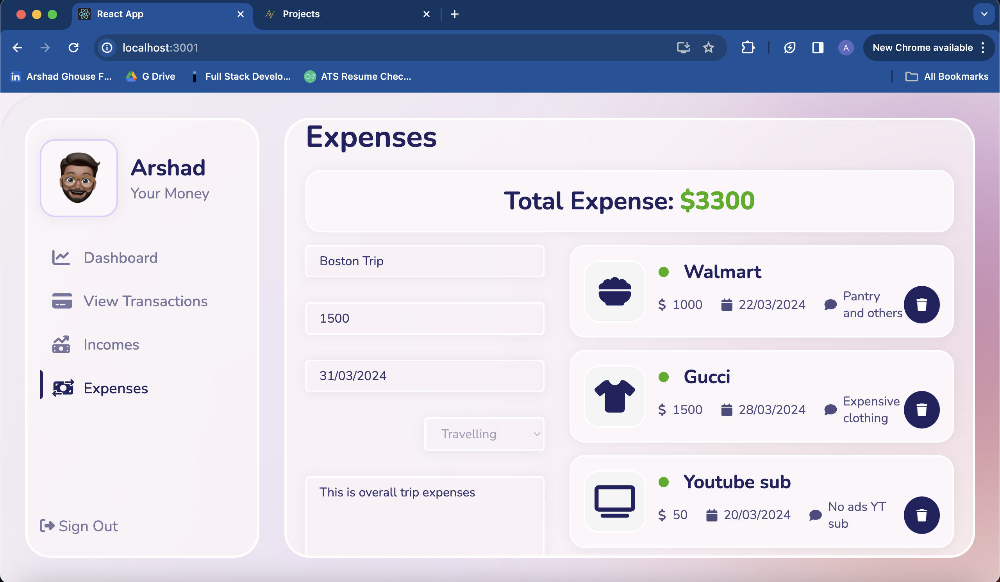

# Expense Tracker

This web application was built using MERN stack which stands for MongoDB (Database), Express.js (Middleware), React.js (Frontend) and Node.js (Backend).

**Use case:** It helps users to input their incomes along with expenses and plan their savings accordingly. It provides a multitude of features including Charts for visualisations possible using Chart.js along with a recent history record to indicate the recent items included into database from the frontend.

Below are some features in detail:

## Features

- Add new expenses with details such as title, amount, category, description, and date.
- View a list of all expenses with the ability to filter by date.
- Equiped with chart for visualisations to depict the savings calculated.
- See a summary of your expenses for the current month.
- Easily manage and categorize your expenses.

## Demo

You can try out the Expense Tracker app live [here](https://example.com).

## Screenshots





## Installation and Running

To run the Expense Tracker app locally, follow these steps:

1. Clone this repository:

   ```bash
   git clone https://github.com/Arshad-isageek/EXPENSE-TRACK.git
   ```

2. Run the backend:

   In the project folder:

   ```bash
   cd backend
   ```

   Use "npm start" command to start the project.

   ```bash
   npm start
   ```

3. Run the frontend:

   Open new terminal parallelly, and perform the scripts below:
   In the project folder:

   ```bash
   cd frontend
   ```

   Use "npm start" command to start the project.

   ```bash
   npm start
   ```

## Video Representation

1. For more information on how it works and connection, please visit the link below:
   https://github.com/Arshad-isageek/EXPENSE-TRACK.git
